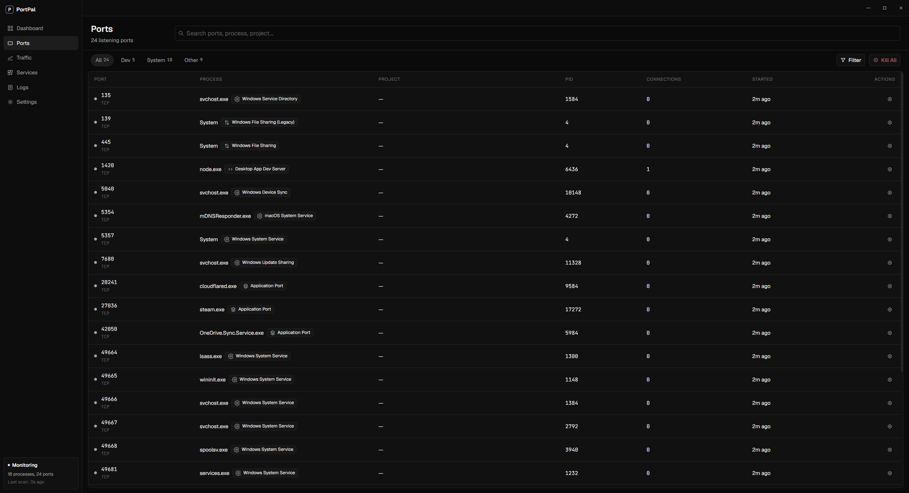
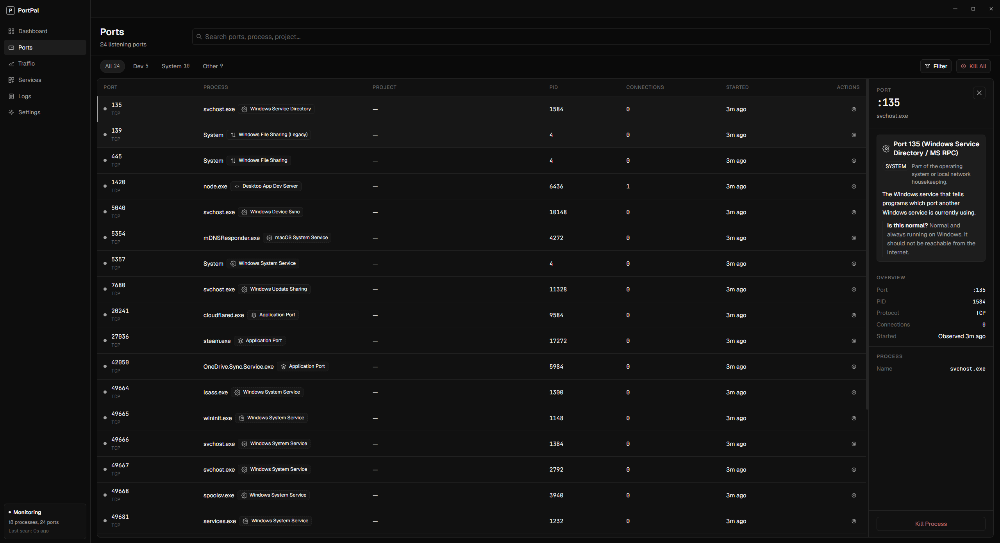
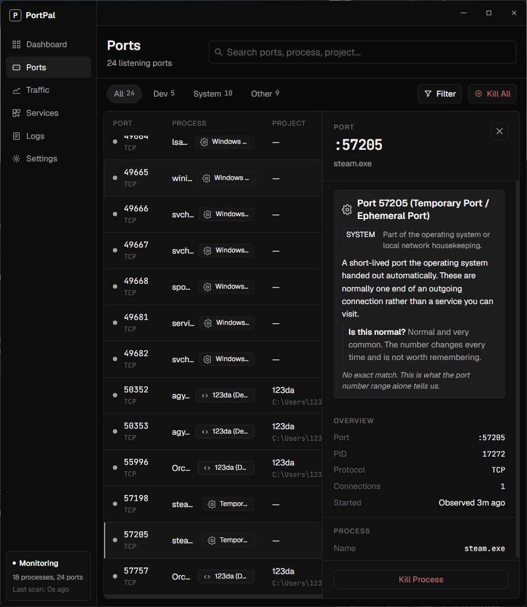
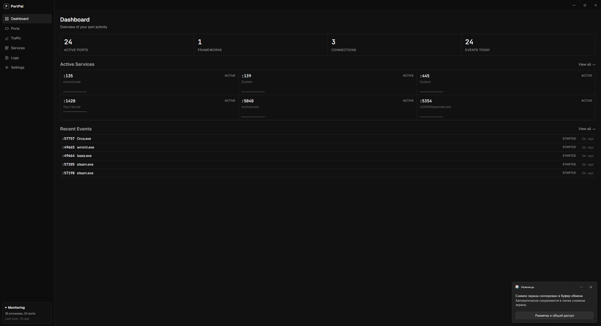

# PortPal

A desktop app that shows every port listening on your machine, tells you in plain
language what each one is, and lets you shut down the ones you actually own.



## Why

`netstat -ano` gives you a PID. Then you look up the PID. Then you decide whether
`svchost.exe` on port 135 is something you can safely kill, and usually you guess.

PortPal does the lookup for you. Every port is named, categorized, and explained,
and the ones that would break your machine refuse to be killed.

## What it does

**Names every port.** Each row carries the process, PID, protocol, live connection
count, and how long it has been listening. Ports are grouped into **Dev**, **System**,
and **Other**, so the three dev servers you care about aren't buried under eighteen
Windows services.

**Explains what you're looking at.** Select any port and the detail panel answers the
question you actually have — what this service is, and whether it's normal for it to
be there.



When no exact match exists, PortPal says so rather than inventing one. An ephemeral
port gets explained as an ephemeral port, with a note that the number is meaningless
and will change:



**Refuses to kill what matters.** Ports 22, 80, 443, 3306, 5432, 6379 and 27017, and
the processes `system`, `svchost`, `lsass`, `postgres`, `redis-server`, `mysqld` and
`mongod`, are protected. Kill and Kill All skip them. The guard lives in
`shared/taxonomy.json` and both the Rust and TypeScript sides assert against that one
file in their test suites, so the two halves cannot drift apart.

**Watches in the background.** A tray icon tracks scan health — green, yellow, red —
and rescans every two seconds. The dashboard keeps a running count of ports,
detected frameworks, live connections and start/stop events.



## Install

No builds are published yet — build from source for now. The bundle targets are set
up for an NSIS installer and portable `.exe` on Windows and an AppImage on Linux;
macOS builds run but aren't bundled.

## Build from source

Needs Node 22+ and a Rust toolchain.

```bash
git clone https://github.com/sonidim25-oss/Portpal.git
cd Portpal
npm install
npm run tauri dev          # run it
npx tauri build            # package it
```

`npm run dev` alone starts Vite only; the backend IPC is unavailable in that mode.

## How it works

A React 19 + TypeScript frontend in a Tauri 2 shell, with the scanning in Rust.

Port discovery shells out to the platform's own tool — `netstat -ano` on Windows,
`lsof` on macOS and Linux — and parses the output structurally rather than by
matching its text, because Windows localizes the State column and text matching
reported zero ports on every non-English install. Connection counts take a second
tool on Linux (`ss`), which is why a missing dependency is checked for both
capabilities at startup rather than surfacing as an empty list minutes later.

A failed scan is never flattened into an empty list. "Nothing is listening" and "the
scan did not run" are different claims, and the kill guards depend on telling them
apart.

## Development

```bash
npm run test:run           # Vitest
npm run test:e2e           # Playwright
cd src-tauri && cargo test # Rust suite
npm run build              # tsc + vite build — the typecheck gate
```

A green Vitest run does not mean the build passes; Vitest transpiles without
typechecking. Run `npm run build` before assuming frontend work is sound.

## License

MIT — see [LICENSE](LICENSE).

Forked from [wisher567/Portpal](https://github.com/wisher567/Portpal).
